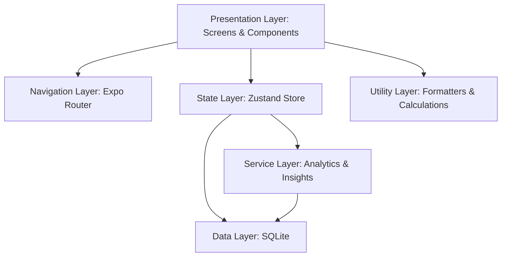

# Habit Money: Architecture Documentation

This document outlines the high-level architecture and design patterns used in **Habit Money**.

## 🏗️ System Overview

Habit Money is an Expo-based cross-platform mobile application designed with a **100% Offline-First** philosophy. It prioritizes data privacy and high-speed local processing.

---

## 📂 Project Structure

- **`/app`**: Expo Router root. Defines the file-based navigation (tabs, stacks).
- **`/assets`**: App icons, splash screens, and constant images.
- **`/src/components`**: Reusable UI elements (transaction items, cards, charts).
- **`/src/db`**: Database schema, initialization, and direct SQLite commands.
- **`/src/i18n`**: Multi-language support (EN/ES) and translation files.
- **`/src/screens`**: Feature-specific views (Dashboard, Settings, Goals, etc.).
- **`/src/services`**: Complex business logic, calculation engines, and third-party integrations (AdMob).
- **`/src/store`**: Centralized state management using Zustand. Handles persistence of critical settings.
- **`/src/utils`**: Date formatters, CSV export logic, and mathematical helpers.

---

## 🧩 Architectural Layers

### 1. Presentation & Navigation

The UI is built with **React Native Paper** (Material Design 3), ensuring a premium, consistent look. Navigation is handled by **Expo Router**, which provides a robust, file-based routing system similar to Next.js.

### 2. State Management (Zustand)

We use **Zustand** for lightweight, performant state management.

- **`useStore`**: Manages global app data (Accounts, Transactions) and UI state (Dark Mode, Language).
- **`useFilterStore`**: Handles scoped state for transaction filtering across the app.

### 3. Data Persistence (SQLite)

- All financial data is stored locally.
- **`src/db/schema.ts`** handles table creation, indexing, and migrations.

### 4. Service Layer (Analytics & Insights)

The **InsightEngine** analyze user data in real-time to generate financial health scores and spending alerts. This logic is separated from the UI to ensure testability and performance.

### 5. Localization (i18n)

Full internationalization is built-in. Every string in the app is keyed in `en.ts` or `es.ts`, and the locale is automatically detected on the first launch via `expo-localization`.

---

## ⚡ Key Design Patterns

- **Separation of Concerns**: UI components focus on rendering, while Stores handle data fetching and logic.
- **Immutable State**: Zustand stores are updated via pure functions to ensure predictable UI updates.
- **UTC Standardization**: All dates are processed in UTC at the core level to prevent time-drift or calculation errors across locales.
- **Lazy Loading**: Complex visual assets like charts are only rendered when needed to maintain app fluidity.
