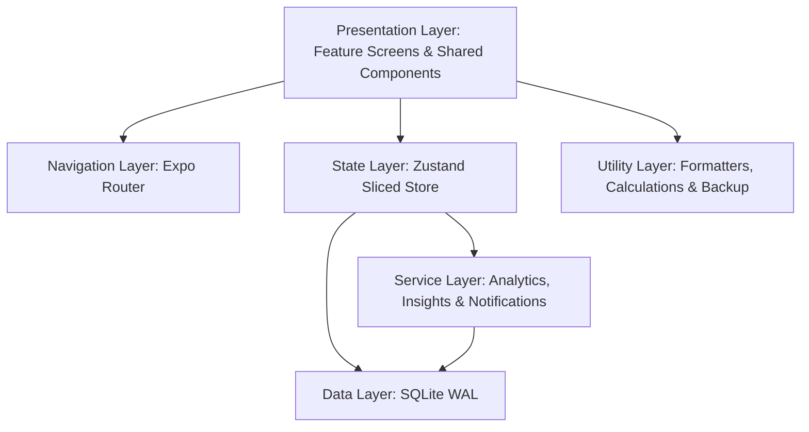

# Habit Money: Architecture Documentation

This document outlines the high-level architecture and design patterns used in **Habit Money**.

## 🏗️ System Overview

Habit Money is an Expo-based cross-platform mobile application designed with a **100% Offline-First** philosophy. It prioritizes data privacy and high-speed local processing.



---

## 📂 Project Structure

The codebase follows a **feature-based architecture**. Each domain (dashboard, transactions, accounts, etc.) owns its screens, components, and feature-specific services, colocated under `src/features/<feature-name>/`. Shared, cross-cutting concerns live in dedicated top-level directories.

```
fin-habit/
├── app/                        # Expo Router entry: file-based navigation (tabs & stacks)
│   ├── (tabs)/                 # Bottom-tab routes
│   └── *.tsx                   # Stack routes (add-account, add-transaction, goals, etc.)
├── assets/                     # App icons, splash screen, and static images
├── src/
│   ├── features/               # Feature modules (colocated screens, components & services)
│   │   ├── accounts/
│   │   ├── budgets/
│   │   ├── categories/
│   │   ├── dashboard/
│   │   ├── goals/
│   │   ├── insights/
│   │   ├── settings/
│   │   └── transactions/
│   ├── shared/
│   │   └── components/         # Truly reusable UI primitives (cards, modals, pickers…)
│   ├── db/
│   │   └── schema.ts           # Table creation, indexing, and migrations
│   ├── store/
│   │   ├── useStore.ts         # Root Zustand store (combines all slices)
│   │   ├── useFilterStore.ts   # Scoped transaction-filter state
│   │   ├── types.ts            # Global store type definitions
│   │   └── slices/             # Domain slices (accounts, categories, transactions, …)
│   ├── services/
│   │   ├── analytics/          # AnalyticsService, InsightEngine, AnalyticsManager
│   │   └── NotificationService.ts
│   ├── i18n/                   # Translations (en.ts / es.ts) and locale helpers
│   ├── theme/                  # Color tokens and Material Design 3 theme config
│   ├── constants/              # App-wide constants (colors, icon sets, currencies…)
│   ├── navigation/             # Navigation helpers and typed route params
│   ├── ads/                    # AdMob banner/interstitial wrappers
│   └── utils/
│       ├── csvExport.ts        # CSV generation and sharing
│       ├── dataBackup.ts       # JSON backup and restore logic
│       ├── dateFilters.ts      # Date-range filtering helpers
│       ├── dateUtils.ts        # UTC/local conversion utilities
│       ├── formatters.ts       # Currency and number formatting
│       ├── responsive.ts       # Screen-size helpers
│       └── scoreCalculator.ts  # Financial health score computation
├── docs/                       # Architecture, database design, and legal docs
└── seeds/                      # Seed data for development and testing
```

---

## 🧩 Architectural Layers

### 1. Presentation & Navigation

The UI is built with **React Native Paper** (Material Design 3), ensuring a premium, consistent look. Navigation is handled by **Expo Router**, which provides a robust, file-based routing system similar to Next.js.

Each feature module exports its screens and components through a barrel `index.ts`, keeping imports clean and enforcing feature boundaries.

### 2. State Management (Zustand — Sliced Store)

We use **Zustand v5** with a **sliced store pattern** for lightweight, performant state management. Each domain slice lives in `src/store/slices/` and is composed into the root store in `useStore.ts`.

| Slice               | Responsibility                               |
| ------------------- | -------------------------------------------- |
| `accountsSlice`     | Account CRUD and balance management          |
| `categoriesSlice`   | Category CRUD and ordering                   |
| `budgetsSlice`      | Budget CRUD and spending-limit tracking      |
| `goalsSlice`        | Goal CRUD and progress tracking              |
| `transactionsSlice` | Transaction CRUD, filtering, and totals      |
| `settingsSlice`     | Language, currency, theme, and notifications |

- **`useFilterStore`**: Dedicated store for transaction filter state (date range, type, category), keeping filter logic isolated from the main data store.

### 3. Data Persistence (SQLite)

- All financial data is stored **locally** on the device — no cloud sync, no external API calls.
- **`src/db/schema.ts`** handles table creation, indexing, and forward-only migrations.
- **WAL mode** is enabled for improved concurrency and write performance.
- Key indexes on `transactions(date)`, `transactions(accountId)`, and `transactions(categoryId)` ensure fast filtering even with thousands of records.

See [DATABASE_DESIGN.md](DATABASE_DESIGN.md) for the full schema and ERD.

### 4. Service Layer (Analytics, Insights, & Notifications)

- **`AnalyticsService`**: Queries SQLite directly to compute spending totals, income vs. balance-adjustment breakdowns, and category-level growth rates.
- **`InsightEngine`**: Wraps `AnalyticsService` to derive actionable insights (savings rate, frequency alerts, financial health score).
- **`AnalyticsManager`**: Facade that aggregates and caches insight data for the Insights screen.
- **`NotificationService`**: Schedules and cancels local daily/weekly reminders via `expo-notifications` to encourage consistent app usage.

All service logic is decoupled from the UI layer to maximize testability and enable future unit tests.

### 5. Localization (i18n)

Full internationalization is built-in using `expo-localization`. Every user-facing string is keyed in `src/i18n/en.ts` or `src/i18n/es.ts`. On first launch, the **Onboarding** flow auto-detects the system locale and lets the user confirm or override the language and currency before entering the app.

---

## ⚡ Key Design Patterns

- **Feature-Based Architecture**: Screens, components, and feature-specific services are colocated per domain. This keeps the codebase navigable and prevents cross-feature coupling.
- **Barrel Exports**: Each feature exposes a single `index.ts` entry point, enforcing a clean public API for every module.
- **Separation of Concerns**: UI components are responsible only for rendering. Stores handle data fetching, mutations, and derived state. Services handle business logic.
- **Sliced Zustand Store**: State is divided into domain slices and composed at the root store level, making each slice independently understandable and easy to extend.
- **Immutable State**: Zustand stores are updated via pure setter functions to ensure predictable UI updates and simple debugging.
- **UTC Standardization**: All dates are stored and processed in UTC at the core level to prevent time-drift or calculation errors across locales. Display formatting applies the device timezone only at the presentation layer.
- **Lazy Rendering**: Complex visual assets (charts, heavy lists) are only rendered when the relevant screen is focused, using `useFocusEffect` and `FlashList` for optimal fluidity.
- **Performance Lists**: `@shopify/flash-list` replaces standard `FlatList` throughout the app, delivering significantly better scroll performance with large transaction datasets.
