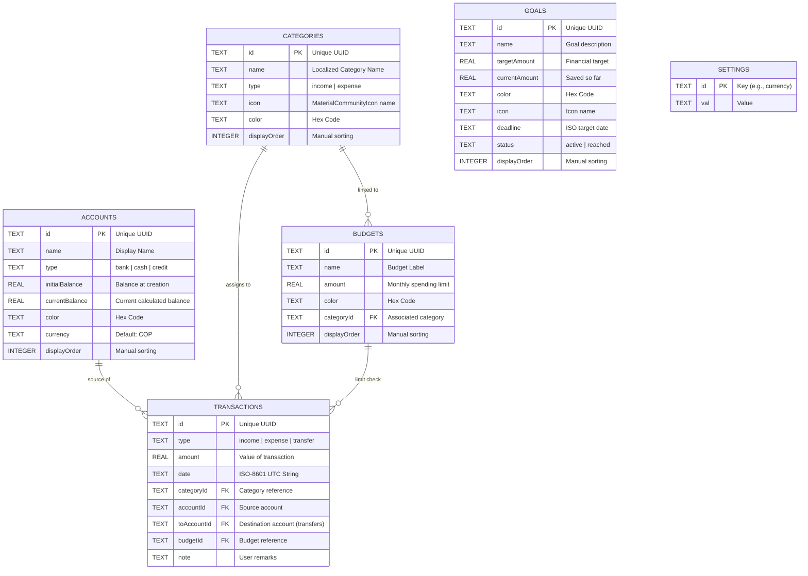

# Habit Money: Database Design Documentation

This document describes the structure and relationships of the local SQLite database used by **Habit Money**.

## 🏗️ Architecture Overview

Habit Money uses **SQLite** through `expo-sqlite`. The database is localized to the user's device, ensuring 100% privacy and offline functionality.

- **Engine**: WAL (Write-Ahead Logging) mode enabled for performance.

---

## 🗺️ Entity Relationship Diagram (ERD)

---

## 📄 Table Specifications

### 🏦 `accounts`

| Column           | Type    | Constraints   | Description                                  |
| :--------------- | :------ | :------------ | :------------------------------------------- |
| `id`             | TEXT    | PRIMARY KEY   | Unique identifier for each account.          |
| `name`           | TEXT    | NOT NULL      | Personal name given by user.                 |
| `type`           | TEXT    | NOT NULL      | `bank`, `cash`, or `credit`.                 |
| `initialBalance` | REAL    | NOT NULL      | Starting balance when the account was added. |
| `currentBalance` | REAL    | NOT NULL      | Dynamically updated balance.                 |
| `color`          | TEXT    |               | Hexadecimal representation of UI color.      |
| `currency`       | TEXT    | DEFAULT 'COP' | Standard ISO currency code.                  |
| `displayOrder`   | INTEGER | DEFAULT 0     | Order for manual reordering in the list.     |

### 🏷️ `categories`

| Column         | Type    | Constraints       | Description                              |
| :------------- | :------ | :---------------- | :--------------------------------------- |
| `id`           | TEXT    | PRIMARY KEY       | Unique identifier.                       |
| `name`         | TEXT    | NOT NULL          | Localized name (e.g., "Food", "Salary"). |
| `type`         | TEXT    | DEFAULT 'expense' | `income` or `expense`.                   |
| `icon`         | TEXT    |                   | MaterialCommunityIcon icon name.         |
| `color`        | TEXT    |                   | Category UI color.                       |
| `displayOrder` | INTEGER | DEFAULT 0         | Order for manual reordering.             |

### 📅 `transactions`

| Column        | Type | Constraints           | Description                          |
| :------------ | :--- | :-------------------- | :----------------------------------- |
| `id`          | TEXT | PRIMARY KEY           | Unique identifier.                   |
| `type`        | TEXT | NOT NULL              | `income`, `expense`, or `transfer`.  |
| `amount`      | REAL | NOT NULL              | Numerical value.                     |
| `date`        | TEXT | NOT NULL              | Timestamp of transaction.            |
| `categoryId`  | TEXT | REFERENCES categories | Link to the category.                |
| `accountId`   | TEXT | REFERENCES accounts   | Source account.                      |
| `toAccountId` | TEXT | REFERENCES accounts   | For transfers (Destination account). |
| `budgetId`    | TEXT | REFERENCES budgets    | Link to a specific budget limit.     |
| `note`        | TEXT |                       | User description.                    |

### 📊 `budgets`

| Column         | Type    | Constraints           | Description                             |
| :------------- | :------ | :-------------------- | :-------------------------------------- |
| `id`           | TEXT    | PRIMARY KEY           | Unique identifier.                      |
| `name`         | TEXT    | NOT NULL              | Budget label/name.                      |
| `amount`       | REAL    | NOT NULL              | Monthly spending limit.                 |
| `color`        | TEXT    |                       | Hexadecimal representation of UI color. |
| `categoryId`   | TEXT    | REFERENCES categories | Associated category (optional).         |
| `displayOrder` | INTEGER | DEFAULT 0             | Order for manual reordering.            |

### 🎯 `goals`

| Column          | Type    | Constraints      | Description                             |
| :-------------- | :------ | :--------------- | :-------------------------------------- |
| `id`            | TEXT    | PRIMARY KEY      | Unique identifier.                      |
| `name`          | TEXT    | NOT NULL         | Goal description/name.                  |
| `targetAmount`  | REAL    | NOT NULL         | Financial target amount.                |
| `currentAmount` | REAL    | DEFAULT 0        | Amount saved so far.                    |
| `color`         | TEXT    |                  | Hexadecimal representation of UI color. |
| `icon`          | TEXT    | DEFAULT 'trophy' | MaterialCommunityIcon icon name.        |
| `deadline`      | TEXT    |                  | ISO target date.                        |
| `status`        | TEXT    | DEFAULT 'active' | `active` or `reached`.                  |
| `displayOrder`  | INTEGER | DEFAULT 0        | Order for manual reordering.            |

### ⚙️ `settings`

| Column | Type | Constraints | Description                     |
| :----- | :--- | :---------- | :------------------------------ |
| `id`   | TEXT | PRIMARY KEY | Setting key (e.g., 'currency'). |
| `val`  | TEXT | NOT NULL    | Setting value.                  |

---

## ⚡ Performance Optimization

- **Indexing**: Database includes indexes on `transactions(date)`, `transactions(accountId)`, and `transactions(categoryId)` to ensure fast filtering and query performance even with thousands of records.
- **WAL Mode**: Data integrity and concurrent reads/writes are maintained with SQLite's WAL journal mode.
